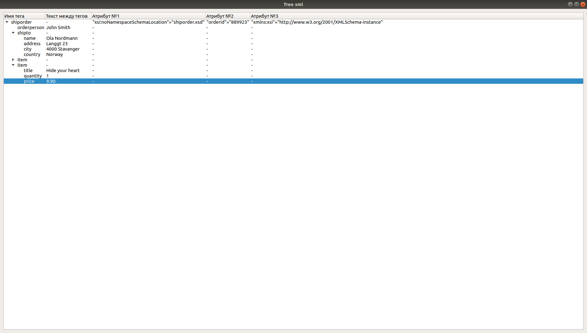

# Отображение xml формата в иерархической модели

Запуск программы:
```
Использование: ./xmltreemodel [параметры]

Параметры:
  -p, --path <path>  Path to xml file
  -h, --help         Prints help text and exit

```

